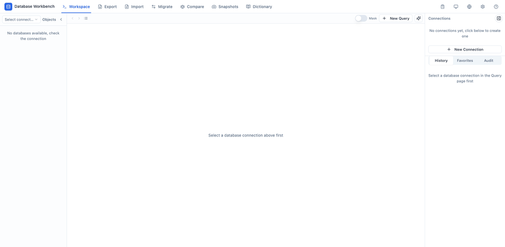

<p align="center">
  
</p>

<div align="center">

# dqex

**AI 原生 · 离线优先的数据库工作台**

[English](README.md) · [简体中文](README.zh-CN.md)

[](LICENSE)
[](go.mod)
[]()
[]()
[](https://github.com/fj1981/dqex/actions/workflows/ci.yml)

[](https://github.com/fj1981/dqex/stargazers)
[](https://github.com/fj1981/dqex/network/members)

</div>

---

## 🚀 一个工具，覆盖所有环境 —— 包括完全隔离的机房

dqex 是一款跨平台数据库工作台，以**单个静态二进制**交付 —— 没有 JVM、没有 Electron、没有安装器、不需要联网。它把**导入、导出、迁移、对比、快照、Excel 数据字典、完整 SQL 终端和 AI 助手**集成于一体，同时提供精美的 Web 界面与可脚本化的 CLI。

- 🪶 **零依赖** —— 拷进 U 盘，就能在银行隔离机房跑起来
- ⚡ **启动 <1 秒**，内存占用约 50–60 MB
- 🤖 **AI 原生智能体** —— 先探索你的*真实*表结构，再生成符合方言的 SQL，未经确认绝不执行
- 🧩 **Web + CLI 同一引擎** —— 两端的连接、任务、历史完全共享
- 🌐 **MySQL · PostgreSQL · Oracle** —— 跨类型迁移自动做方言转换
- 📋 **Excel 数据字典 & 快照对比报告** —— 天生满足合规审计（等保 / GDPR / 项目验收）
- 🏠 **安全地把生产数据带回家** —— 条件导出 + gzip 压缩，两条命令还原到本地测试库

---

## ✨ 功能一览

| 功能 | Web | CLI | 说明 |
|---|---|---|---|
| 导出 | ✅ | `export` (`exp`) | 结构 + 数据 → SQL 文件（zip / gzip），支持条件过滤与一致性快照 |
| 导入 | ✅ | `import` (`imp`) | SQL / zip 文件 → 数据库，自动建表、批量插入 |
| 迁移 | ✅ | `migrate` (`mig`) | 数据库 → 数据库，**跨方言**（如 MySQL → PostgreSQL） |
| 对比 | ✅ | `compare` (`cmp`) | 两个数据库的结构与数据差异 |
| 数据字典 | ✅ | `dictionary` (`dict`) | 表结构 + 注释 → 精美 Excel（.xlsx），审计就绪 |
| 快照 | ✅ | `snapshot` (`snap`) | 创建 / 列表 / 查看 / 删除 / 对比 全生命周期 |
| SQL 查询 | ✅ | `sql` | Web 查询终端 + 表浏览器；CLI 交互式 REPL，支持 JSON 输出 |
| AI 辅助写 SQL | ✅ | `sql` 内 `\ai` | 智能体查询真实表结构后生成 SQL（按目标方言），需确认 |
| 连接管理 | ✅ | `conn` (`cn`) | 保存 / 测试 / 删除数据库连接 |
| 任务配置 | ✅ | `task` (`tk`) | 一键复用任务配置（`--task <ID>`） |
| 执行历史 | ✅ | `history` (`his`) | 执行记录，故障排查与审计导出 |
| Shell 补全 | — | `completion` | zsh / bash 补全脚本 |

---

## 🧑‍💻 快速开始

### 下载

从 [Releases 页面](https://github.com/fj1981/dqex/releases) 下载对应平台的 zip 包并解压 —— **无需安装**。

### Linux / macOS

```bash
./install.sh                    # 安装到 /usr/local/bin（可选）
dqex                            # 启动 Web 界面（127.0.0.1:8181）
# 或不安装直接使用：
./start.sh                      # 前台运行（Ctrl+C 停止）
./start.sh -d                   # 后台运行
./stop.sh                       # 停止后台服务
```

### Windows

```bat
install.bat                     :: 安装到 %LOCALAPPDATA%\dqex 并加入 PATH
dqex                            :: 新开终端启动 Web 界面
:: 或不安装直接使用：
start.bat                       :: 前台运行
start.bat -d                    :: 后台运行
stop.bat                        :: 停止后台服务
```

### CLI 30 秒上手

```bash
# 连接只需保存一次，随处复用
dqex conn add --name 生产库 --type mysql --host 10.20.16.170 --port 3317 --un root --pw 'xxx'

# 条件导出 + gzip，带回家调试
dqex exp camunda -s 生产库 -o backup.sql.gz --table-cond "orders:created_at >= '2026-01-01'"

# 还原到本地测试库
dqex imp -t 本地测试库 -i backup.sql.gz --reset drop-and-create

# 交互式 SQL 终端（按目标库方言原生执行）
dqex sql -c 生产库
dqex sql -c 生产库 --json "SELECT id, name FROM users LIMIT 10"   # 智能体友好 JSON

# 快照对比 —— 故障排查的杀手级特性
dqex snapshot create -c 生产库 -n 基线
dqex snapshot compare -c 生产库 --a 基线 --b 部署后

# 合规审计：一条命令生成精美 Excel 数据字典
dqex dict camunda -s 生产库 -o 数据字典.xlsx
```

---

## 🤖 AI 辅助写 SQL（可选模块，离线安全）

<p align="center">
  
</p>

- **基于真实表结构，杜绝凭空想象** —— 生成前自动查询库表结构（Web 端实时显示查询进度）
- **生成 ≠ 执行** —— AI 只产出 SQL 文本；写操作需二次确认、危险语句被拦截，可 `\e` 编辑后再执行
- **完整辅助闭环** —— `\ai continue` 基于上文续写；Web 端支持生成 / 解释 / 优化 / 修复，diff 预览后一键应用到编辑器
- **密钥不出本机** —— API Key 存本地，界面仅显示掩码后的端点与模型名
- **未配置无入口** —— BaseURL / API Key / Model 三项齐全才启用，不影响任何既有功能
- **离线兜底** —— 内置 SQL 模板库（`\template top_n orders amount 10`），完全隔离网络也能用

---

## 🛠️ 从源码构建

```bash
make dev                # Go :8181 + Vite :5281，热重载 + 调试
make build              # 单二进制 ./dqex（内嵌前端）
make release            # 跨平台打包 → release/
make install            # → /usr/local/bin
```

---

## 🧱 技术栈

- **后端**：Go + [infrakit](https://github.com/fj1981/infrakit)（数据库方言适配）、Gin、内嵌 SQLite
- **前端**：React + TypeScript + Vite + Tailwind CSS + shadcn/ui + Monaco Editor
- **Excel**：excelize（纯 Go，无 CGO）
- **交付**：单静态二进制内嵌前端，支持深色模式与中英双语

---

## 📚 文档

- [CLI 使用手册](CLI.md) —— 每个命令、参数与元命令
- [项目概览](docs/OVERVIEW.md) —— 设计哲学、用户画像与深度场景
- [开发约定](docs/conventions.md) —— 状态建模与数据流规范（贡献前必读）

---

## 🤝 贡献指南

开源因贡献而伟大 —— 而每一次贡献，都会让你离 star 榜更近一步！⭐

我们欢迎：
- 🐛 Bug 修复（最高优先级）
- 📝 文档改进（中英文皆可）
- 🧩 新的 SQL 模板（丰富离线模板库）
- 🗄️ 更多数据库驱动支持
- 🎨 UI/UX 优化

**贡献流程：**

1. Fork 本仓库
2. 创建分支：`git checkout -b feature/your-feature`
3. 提交更改：`git commit -am 'feat: add something awesome'`
4. 推送分支：`git push origin feature/your-feature`
5. 发起 Pull Request

代码规范：Go 遵循 `gofmt`；TypeScript 遵循 ESLint + Prettier；提交信息遵循 [Conventional Commits](https://www.conventionalcommits.org/)。

---

## 📄 许可证

[MIT](LICENSE) © 2026 fj1981

**给 dqex 点个 ⭐** —— 这是对我们最大的鼓励，也让更多开发者发现这个工具。Fork 它、玩它、拆它，然后给我们发个 PR！
